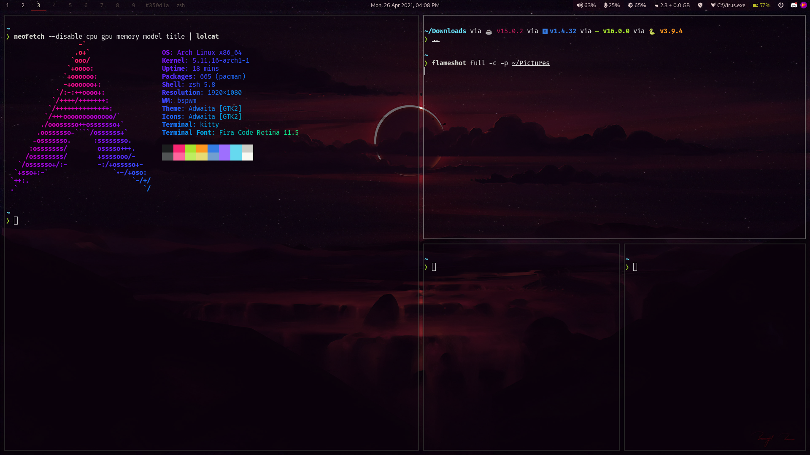
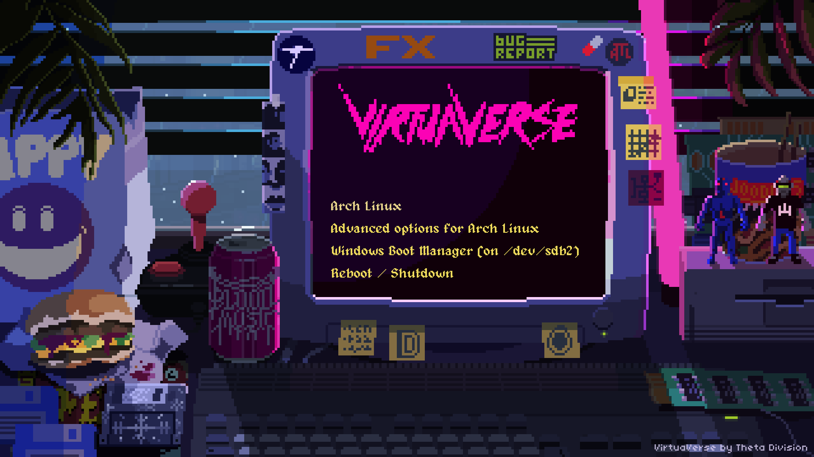

# My dotfiles?

I'm always jumping through servers and re-installations and I've found that I just miss those few essential features from zsh and my favorite prompt (Shout out to starship). Couple of google searches later, this repo was born. I considered forking from other popular dotfiles repositories, but considering I'm relatively inexperienced with the shell, I just wanted to start afresh.

Edit: Haha! As I'm trying to commit, I realize my git user and email isn't configured. This is exactly what I hope this will solve.

I currently run Manjaro Linux with the bspwm window manager. Here's a preview of how my desktop looks like:

#### Grub Theme

Grub theme inspired by [Patato777/dotfiles](https://github.com/Patato777/dotfiles). Background by [Valen](https://twitter.com/MrValenberg)[berg](https://valenberg.com/).
